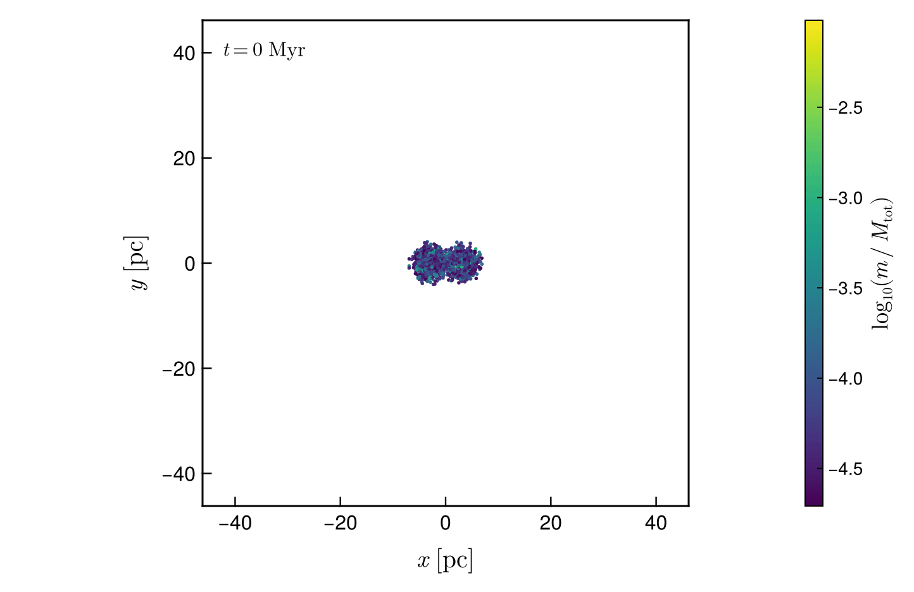

# Nbody6Dynamics.jl

[](https://github.com/PaulGoG/Nbody6Dynamics.jl/actions/workflows/CI.yml)
[](https://PaulGoG.github.io/Nbody6Dynamics.jl/dev/)
[](https://codecov.io/gh/PaulGoG/Nbody6Dynamics.jl)
[](https://github.com/JuliaTesting/Aqua.jl)
[](https://julialang.org)
[](LICENSE)
[](https://www.repostatus.org/#active)

A Julia package that automates the full lifecycle of [Nbody6PPGPU-beijing](https://github.com/nbody6ppgpu/Nbody6PPGPU-beijing) star-cluster simulations: install/build of the Fortran code, multi-cluster merger initial-condition generation, simulation execution, post-processing of all standard output files, and figures. Every phase is driven by a single TOML configuration and orchestrated through one entry point, `run_pipeline`.


*Two King clusters of 4000 stars each, released 6 pc apart on an eccentric orbit, and the
remnant they leave 12 Myr later. Note the axes: the pair spans 12 pc, the remnant and its halo
nearly 70 pc. Initial conditions, integration, analysis and figure were all produced by this
package from one configuration file; the case is `input_files/showcase/`.*



*The same run animated on fixed axes, one frame per Myr. The two clusters fall together and
coalesce at 4 Myr, after which the remnant relaxes and sheds the halo of loosely bound stars
that fills the frame. Every run writes animations like this one alongside its static figures.*

## Project structure

```
Nbody6Dynamics/
├── Project.toml      # Package metadata and dependencies
├── activate.jl       # Activates and instantiates the package environment
├── config.toml       # Main pipeline configuration (edit this)
├── src/              # Library: orchestration, IC generator, readers, diagnostics
├── ext/              # Makie extension: figures and animations
├── scripts/          # CLI entry points
├── input_files/      # Engine .inp files, merger/sweep TOMLs, showcase cases
├── test/             # Unit and physics-validation suite
├── bench/            # Benchmarks and scaling scripts
├── docs/             # Documenter.jl site sources
├── deps/cuda/        # NVIDIA samples headers used by the CUDA build
├── backend/          # (gitignored) engine checkout and build
└── runs/             # (gitignored) run outputs
```

The full tree is at the end of this file.

## Environment setup

Requires Julia ≥ 1.13, installed through [juliaup](https://github.com/JuliaLang/juliaup) (`juliaup add release`). Development and the validated hosts run Julia 1.13. Manifests are not under version control: each environment resolves from its `Project.toml` on first activation, and every run stores the manifest it resolved as `environment_manifest.toml` in its run directory.

Every environment ships an activation script that activates and instantiates it silently. Running one on a new machine performs the dependency resolution and precompilation once:

```bash
julia activate.jl          # package environment (required)
julia scripts/activate.jl  # entry scripts: the package plus its figure backend
julia docs/activate.jl     # documentation build (optional)
julia bench/activate.jl    # benchmarks (optional)
```

An interactive session starts with `julia -i activate.jl`.

The scripts under `scripts/`, `docs/` and `bench/` include their environment's activation script, so they need no project flag; those environments develop the package by a relative path and always run against the local source. Building the Fortran backend additionally needs `git`, `gfortran`/`make`, and optionally HDF5 and CUDA (auto-detected; see `[build]` in `config.toml`).

### Figures are an extension

The figure routines are a package extension triggered by a Makie backend, so a headless host installs no plotting stack. Initial conditions, engine build, integration, readers, diagnostics and benchmarks all run without them.

```julia
using CairoMakie        # brings in every plot_*, animate_* and generate_plots
using Nbody6Dynamics
```

Without a backend the figure routines report the remedy instead of failing obscurely, and a pipeline whose `[visualization] enabled = true` is refused before it builds or integrates anything rather than after. `plotting_available()` answers the question in code. The entry scripts under `scripts/` load CairoMakie for you; a numerics-only session (`julia activate.jl`, then `using Nbody6Dynamics`) does not.

## Entry points

One invocation each; details in the sections below.

| Task | Invocation |
|------|------------|
| Instantiate the package environment | `julia activate.jl` |
| Instantiate the script environment (figures) | `julia scripts/activate.jl` |
| Run the main pipeline | `julia scripts/run_setup.jl [config.toml]` |
| Run a parameter sweep | `julia scripts/run_sweep.jl input_files/sweep_demo.toml [--dry-run]` |
| Run a showcase case | `julia scripts/run_setup.jl input_files/showcase/equal_pipeline.toml` (also `binary_`, `tidal_`; the sweep via `scripts/run_sweep.jl input_files/showcase/sweep.toml`) |
| Run the verification suite | `julia scripts/run_verif_suite.jl` |
| Execute the test suite | `julia -e 'include("activate.jl"); Pkg.test()'` |
| Run the benchmarks | `julia bench/benchmarks.jl` |
| Validate a CUDA host | `julia scripts/run_gpu_validation.jl` (GPU-gated suite, GPU and CPU pipelines, scaling benchmark; host record, logs and results under `runs/gpu_validation_<host>_<timestamp>/`; `--dry-run`, `--stages=`) |
| Build and run on a CUDA host by hand | `julia scripts/run_setup.jl input_files/gpu/gpu_pipeline.toml` (CPU reference: `cpu_pipeline.toml`; recipe in the manual) |
| Measure the GPU speed-up | `julia bench/gpu_scaling.jl 20000,50000 4,8 "0;0,1" 0.25` (needs the CPU and the GPU binary) |
| Build the documentation | `julia docs/make.jl` (also executes the walkthrough; the site lands in `docs/build/`) |

## Usage

`run_pipeline(cfg)` is the single entry point; `config.toml` flags select which phases run. Six modes:

| # | Mode | Config flags |
|---|------|--------------|
| 1 | Full pipeline | `install.enabled=true`, `simulation.run_test=true` |
| 2 | Simulate only | `install.enabled=false`, `simulation.run_test=true` |
| 3 | Postprocess only | `simulation.run_test=false`, `postprocess.data_dir="/path/to/output"` |
| 4 | Re-plot latest run | `simulation.run_test=false`, `postprocess.data_dir=""` |
| 5 | Merger ICs only | `merger.enabled=true`, `merger.config_file="input_files/..."` |
| 6 | Merger + simulate | `merger.enabled=true`, `simulation.run_test=true` |

```julia
using Nbody6Dynamics
cfg = load_config("config.toml")
results = run_pipeline(cfg)   # Dict with :snapshots, :diagnostics, :lagr, :escapers, :stellar_evo
```

Or via the CLI wrapper:

```bash
julia scripts/run_setup.jl [config.toml]
```

Standalone merger IC generation (no main config needed):

```julia
result = run_merger_pipeline("input_files/merger_equal_mass.toml")
# writes dat.10, merger.inp, merger_summary.txt + diagnostic plots
```

Post-process any directory containing Nbody6++ output, config-free:

```julia
scan = scan_output("/scratch/sim42/output")     # report available files
results = postprocess_external("/scratch/sim42/output")
```

Each run gets an isolated `runs/<run_id>/` directory (`output/`, `plots/`, frozen `config.toml`). Run IDs come from `generate_run_id` (prefix + timestamp + 4-hex uniqueness suffix); merger runs prepend `merger_` to the configured prefix.

The directory of the configuration file is the project directory: relative paths in the file (`install_dir`, `input_file`, `runs_dir`, `data_dir`, `config_file`) resolve against it, and `backend/` and `runs/` are created there, never inside the package. A project therefore needs only a `config.toml`; the shipped inputs are reachable through `example_input("N1k_quick.inp")` when the package was installed by URL rather than cloned.

## Status

| Component | Status | Notes |
|-----------|--------|-------|
| Install / build | Working | Clone, `configure`, HDF5 Makefile patch, parallel make; CUDA path auto-detection; GPU builds compiled for the visible devices' compute capabilities or an explicit `cuda_arch` list (the upstream configure emits no architecture flag), `BUILD_INFO.toml` next to the binary, CPU/GPU/MPI binary variants selected by suffix. Validated on four CUDA hosts (compute capability 7.5 to 12.0, CUDA 11.8 to 13.1); see the manual, section Validated hardware |
| Merger IC generator | Working | Plummer + King samplers (King c(W0) validated against published concentrations); Kroupa (2001) IMF; Kepler two-body and explicit N-cluster orbit modes; primordial binaries (Kroupa 1995 periods, thermal eccentricities, written in the engine's pair convention); Jacobi truncation; seeded reproducibility — the TOML `seed` drives the sampler RNG and propagates to Nbody6's `NRAND`; the output intervals are written as dyadic rationals with exact decimals, because the engine's digit counter never terminates on other values. The engine itself has no multi-centre diagnostics: cluster-level results before coalescence come from the snapshot-based per-cluster tools, not from `lagr.7`/`esc.11`; see "Feasibility and limitations" in the merger documentation |
| Remnant diagnostics | Working | Bound remnant of the whole system per snapshot: Casertano–Hut core radius (engine densities or sixth-neighbour estimate), half-mass radius, rotation (λ_R, Peebles λ_P, spin alignment with the orbital angular momentum, v_rot/σ profile), Allison et al. (2009) Λ_MSR mass segregation with segregation time, union-find coalescence time; `remnant_diagnostics.csv` and four figures per merger run |
| Stellar population | Working | `STELLAR_CLASSES` (engine grouping of K* = −1…15), `hr_population` (single stars and members of KS pairs together), `stellar_census` per epoch and class, written as `stellar_census.csv`; HR figures with a run-level legend and a census strip |
| Parameter sweeps | Working | Sweep TOML → Cartesian grid over dotted merger-TOML keys × seeds; one directory per point with derived configs validated before launch; points run as concurrent worker processes (`omp_threads` per job from the cost model); `sweep_index.toml` kept current, `sweep_summary.csv` with final N, pairs, energy error and virial ratio; comparison figures on common axes coloured by one grid axis; seeded ensembles (a sweep without axes, or the seeds of every grid point) summarised by median and central 68/95 % bands on a common time grid; `controls = true` adds the isolated single-cluster equivalent of every point and a paired merger-versus-control figure |
| Simulation runner | Working | Launch script with `OMP_NUM_THREADS` and `GPU_LIST` control, live stdout monitoring, start-up watchdog and completion monitor (`exit_grace`: an engine that printed `END RUN` but never exits is terminated and recorded as completed), opt-in in-terminal sparklines of the diagnostics (`live_diagnostics`), run summary with exact CPU accounting, sampled CPU/memory/GPU telemetry (`telemetry.csv`), the devices the engine initialised and the build record; restarts from the engine's COMMON dumps (`restart_simulation`) with per-segment bookkeeping; merger runs execute inside the IC output dir so `dat.10` is found |
| I/O readers | Working | `conf.3` (standard + extended; `read_all_conf3` reads in threaded chunks when Julia has more than one thread), `out1000` diagnostics (ADJUST + physical scaling; virial ratio Q = T/\|W\|, equilibrium at 0.5), `lagr.7`, and `esc.11` (incl. the ANGLE PHI / ANGLE THETA escape-direction columns) / `sev.83_*` / `bev.82_*` in the fork's real formats; `STELLAR_TYPE_LABELS` follow the Hurley convention (13 = NS, 14 = BH); `UnitScaling.zmbar` is the total-mass scale factor M*, not the mean stellar mass. `.h5part` files are detected and reported as unsupported |
| Plotting / animation | Working | Publication theme: no titles, no minor ticks, Computer Modern fonts, dashed grey low-opacity grid on line plots; presentation knobs config-driven via `[visualization.style]` (`PlotStyle`); escaper suite (cumulative mass loss, velocity classes, escape anisotropy) and SSE-quantity plots (mass segregation, t/T_MS evolutionary clock, core-mass growth); binary suite (pair counts with the Heggie hard/soft split, binary fraction, `a`–`e` diagrams, period histograms); existing figures are never overwritten (safesave-style `#1`, `#2`, … backups) |
| Load latency | Working | PrecompileTools workload over the configuration, diagnostics-reader and merger-IC paths; the first `load_config` of a session runs compiled |
| Tests | Passing | Unit and physics-validation suite (engine-dependent tests behind `NBODY6_BINARY_TESTS=1`, a GPU-gated set behind `NBODY6_GPU_TESTS=1`), incl. physics validation, adversarial external-input tests, telemetry/thread-control, per-cluster structure, restart, and tidal-field tests |

## Testing

```bash
julia -e 'include("activate.jl"); Pkg.test()'
```

The default suite needs no Fortran binary. The engine-dependent tests (build, launch, restart, tidal field, live telemetry) run when `NBODY6_BINARY_TESTS=1` is set; without `NBODY6_BACKEND_ROOT` they clone and build the backend in a temporary directory, with it they use the build under `<root>/backend/Nbody6PPGPU-beijing`:

```bash
NBODY6_BINARY_TESTS=1 NBODY6_BACKEND_ROOT=$PWD julia -e 'include("activate.jl"); Pkg.test()'
```

The suite covers config round-trips, all I/O readers (synthetic binaries plus real fork output fixtures under `test/fixtures/`), plotting/animation smoke tests, external post-processing (including adversarial malformed inputs), and the merger IC generator. Physics-validation tests check King concentration c(W0) against published values, the Plummer half-mass relation r_hm = 1.305 a, the Kroupa mean mass, virial equilibrium Q = T/|W| = 0.5 after `virialise!`, and the Keplerian orbital energy of generated two-cluster orbits.

For interactive work against the test dependencies, activate the test environment with [`TestEnv.jl`](https://github.com/JuliaTesting/TestEnv.jl): start `julia -i activate.jl` and run `using TestEnv; TestEnv.activate()` in the session.

## Verification Suite

```bash
julia scripts/run_verif_suite.jl
```

Runs three end-to-end targets through `run_pipeline` (requires a built binary in `backend/`):

1. `single` — plain N=5000 run (`N5k_medium.inp`)
2. `triorbit` — bound three-cluster Lagrange triangle (`verif_triorbit.toml`)
3. `3d5cluster` — five clusters distributed in 3D (`verif_3d5cluster.toml`)

## Documentation

Documenter.jl docs live under `docs/` (Manual, Input Files, Cluster Mergers, API Reference):

```bash
julia docs/make.jl   # builds to docs/build/
```

## Licence

The package is released under the MIT licence (`LICENSE`). Two other parties' material is involved. The CUDA helper headers under `deps/cuda/` come from NVIDIA's cuda-samples and carry their BSD-3-Clause licence (`deps/cuda/LICENSE`). The engine, [Nbody6PPGPU-beijing](https://github.com/nbody6ppgpu/Nbody6PPGPU-beijing), is not part of this package: the install phase clones it from its own repository at build time and it remains under the terms its maintainers set; nothing of it is redistributed here.

## How to cite

If this package contributes to published work, please cite it through the metadata in `CITATION.cff`:

```bibtex
@software{Nbody6Dynamics_jl,
  author  = {Gogîță, Paul-Adrian},
  title   = {Nbody6Dynamics.jl},
  version = {0.3.0},
  year    = {2026},
  url     = {https://github.com/PaulGoG/Nbody6Dynamics.jl},
  license = {MIT}
}
```

## Full tree

<details><summary>Full project tree</summary>

```
Nbody6Dynamics/
├── .github/                         # CI, Format, Documentation and Backend workflows; Dependabot configuration
├── .JuliaFormatter.toml             # Formatter configuration
├── .mailmap                         # Author identities folded into one
├── README.md
├── LICENSE                          # MIT
├── CITATION.cff                     # Citation metadata
├── CHANGELOG.md                     # Release history (Changelog.jl conventions)
├── Project.toml                     # Package metadata & dependencies
├── activate.jl                      # Activates and instantiates the package environment
├── config.toml                      # Main pipeline configuration (edit this)
├── deps/cuda/                       # helper_cuda.h, helper_string.h from NVIDIA cuda-samples v13.0 (CUDA 13 build of the engine)
├── src/
│   ├── Nbody6Dynamics.jl               # Module root; run_pipeline orchestrator; exports
│   ├── types.jl                     # Config structs (incl. PlotStyle), Snapshot, records, UnitScaling
│   ├── config.jl                    # TOML loader/serialiser for Nbody6Config
│   ├── util.jl                      # safesave-style never-overwrite backups
│   ├── platform.jl                  # OS/CUDA/dependency detection, hardware fingerprint
│   ├── telemetry.jl                 # Runtime CPU/memory/GPU telemetry of the backend process tree
│   ├── install.jl                   # Clone, configure, HDF5 Makefile patch, build
│   ├── run.jl                       # Simulation launcher: run dirs, launch script, live monitoring
│   ├── gpu_validation.jl            # run_gpu_validation: logged validation stages of a CUDA host under runs/
│   ├── external.jl                  # scan_output + postprocess_external for arbitrary output dirs
│   ├── cluster_structure.jl         # Per-cluster structure from snapshots: bound members, centres, radii, dispersions
│   ├── binary_population.jl         # Binary diagnostics: Heggie hard/soft split, binary fraction, energy scale from snapshots
│   ├── stellar_population.jl        # Stellar classes, HR-plane population, class census
│   ├── remnant.jl                   # Remnant diagnostics: coalescence, Casertano–Hut core radius, rotation, mass segregation
│   ├── sweep.jl                     # Parameter sweeps: grid × seeds, concurrent worker processes, index and summary
│   ├── ensemble.jl                  # Seeded ensembles: series extractors, common-grid percentiles (median, 68/95 %)
│   ├── io/
│   │   ├── io.jl                    # I/O submodule includes
│   │   ├── fortran_binary.jl        # Fortran unformatted record reader
│   │   ├── conf3.jl                 # conf.3 snapshot reader (standard + extended layout)
│   │   ├── diagnostics.jl           # out1000 parser: ADJUST lines + PHYSICAL SCALING
│   │   ├── lagr.jl                  # lagr.7 Lagrangian radii reader
│   │   ├── esc.jl                   # esc.11 escaper reader (fork's real column format)
│   │   ├── stellar_evolution.jl     # sev.83_* single-star evolution reader
│   │   └── binary_evolution.jl      # bev.82_* regularised-binary reader
│   ├── ic/
│   │   ├── ic.jl                    # run_merger_pipeline / generate_merger_ic entry points
│   │   ├── config.jl                # Merger TOML parser: ClusterSpec, OrbitSpec, seed
│   │   ├── control.jl               # Isolated single-cluster control derived from a merger TOML
│   │   ├── models.jl                # Plummer & King (ODE-solved) density samplers
│   │   ├── imf.jl                   # Kroupa (2001) IMF, rescaled & equal-mass variants
│   │   ├── orbits.jl                # Kepler two-body + explicit N-cluster orbits, Jacobi radius, virialise!
│   │   ├── binaries.jl              # Primordial binary populations
│   │   └── output.jl                # dat.10 writer, merger.inp generator (seed → NRAND)
│   └── plotting_api.jl              # Figure interface: the public routines, implemented by the Makie extension
├── ext/
│   ├── Nbody6DynamicsMakieExt.jl    # Extension module, loaded by `using CairoMakie`
│   └── plotting/
│       ├── common.jl                # Publication theme (Computer Modern fonts), figure sizing, axis helpers
│       ├── dispatch.jl              # generate_plots: the single figure dispatcher
│       ├── snapshots.jl             # Projection scatter plots, cluster separation & per-cluster virial
│       ├── energy.jl                # Energy error & particle count from diagnostics
│       ├── lagrangian.jl            # Lagrangian radii evolution
│       ├── hr.jl                    # HR figures: run-level legend, panels, census strip; HR animation
│       ├── escapers.jl              # Escaper analysis: cumulative mass loss, velocities, anisotropy
│       ├── sse.jl                   # SSE-quantity plots: mass segregation, t/T_MS clock, core masses
│       ├── merger.jl                # Merger-run figures: separation, per-cluster virial and structure
│       ├── merger_ic.jl             # Merger IC diagnostic figures
│       ├── binaries.jl              # Binary population, a–e diagram, period distribution
│       ├── remnant.jl               # Remnant figures: rotation parameters and profile, structure, mass segregation
│       ├── sweep.jl                 # Sweep comparison figures on common axes (Lagrangian radius, energy error)
│       ├── control.jl               # Merger against isolated control, paired series per sweep point
│       ├── ensemble.jl              # Ensemble figures: median and 68/95 % bands per grid point
│       ├── animation.jl             # GIF animations (cluster, HR, Lagrangian)
│       └── telemetry.jl             # Run telemetry figure
├── scripts/
│   ├── run_setup.jl                 # CLI wrapper: load config → run_pipeline
│   ├── run_sweep.jl                 # CLI wrapper: sweep TOML → run_sweep → comparison figures
│   ├── run_verif_suite.jl           # Three-target verification suite
│   ├── run_gpu_validation.jl        # CLI wrapper: logged validation stages of a CUDA host
│   ├── activate.jl                  # Activates the script environment (package + CairoMakie)
│   └── Project.toml                 # Script environment: the package and its figure backend
├── test/
│   ├── runtests.jl                  # Suite entry: shared helpers, includes the component files below
│   ├── test_config.jl               # Configuration loading, round trip, validation
│   ├── test_platform_build.jl       # Platform and CUDA detection, engine source tree, GPU build target
│   ├── test_validation.jl           # GPU validation driver and stage verdicts
│   ├── test_run.jl                  # Run IDs, machine identity, watchdogs, restarts, provenance
│   ├── test_io.jl                   # Readers: conf.3, out1000, lagr.7, esc.11, sev.83, bev.82, fixtures
│   ├── test_diagnostics.jl          # Binary population, remnant, stellar classes, cluster structure
│   ├── test_sweep_ensemble.jl       # Sweeps, seeded ensembles, control configurations
│   ├── test_plotting.jl             # Figure extension, smoke tests, canvases, formatting
│   ├── test_external.jl             # External post-processing (+ test_external_adversarial_inner.jl)
│   ├── test_ic.jl                   # Merger initial-condition generator and its physics checks
│   ├── test_telemetry.jl            # Hardware telemetry sampler, readers and figure
│   ├── test_engine_gated.jl         # Shipped GPU-host configurations; engine- and GPU-gated runs
│   ├── test_qa.jl                   # Static QA: Aqua, ExplicitImports, JET
│   └── fixtures/                    # Real Nbody6++ output excerpts (esc.11, lagr.7, out1000, sev.83_0, bev.82_0)
├── bench/
│   ├── thread_scaling.jl            # Thread- and N-scaling of the backend from run telemetry (cost model)
│   ├── gpu_scaling.jl               # GPU-versus-CPU binary at equal N and threads, per GPU_LIST (speed-up table)
│   ├── merger_case.jl               # The two-cluster case shared by the scaling scripts
│   ├── benchmarks.jl                # BenchmarkTools suite (kept out of tests)
│   ├── activate.jl                  # Activates the bench environment (package developed by relative path)
│   └── Project.toml                 # Bench-local environment
├── docs/
│   ├── make.jl                      # Documenter.jl build script
│   ├── activate.jl                  # Activates the docs environment (package developed by relative path)
│   ├── Project.toml                 # Documentation build environment
│   ├── src/                         # index, walkthrough (Literate), manual, input_files, multi_cluster_mergers, api, references
│   ├── src/references.bib           # BibTeX of the sources cited (DocumenterCitations)
│   └── src/assets/                  # figure and animation used by the README and the docs site
├── input_files/
│   ├── N1k_quick.inp                # N=1000 smoke test (seconds)
│   ├── N5k_medium.inp               # N=5000 medium verification run
│   ├── N25k_production.inp          # N=25000 production run
│   ├── N100k_production.inp         # N=100000 production run
│   ├── gc_bh_subsystem.inp          # Globular cluster with BH subsystem
│   ├── imbh_runaway.inp             # IMBH formation via runaway collisions
│   ├── pop3_cluster.inp             # Population III near-zero-metallicity cluster
│   ├── tidal_tails.inp              # Tidal-tail formation, Galactic-centre cluster
│   ├── young_massive_binaries.inp   # Young massive cluster, high binary fraction
│   ├── merger_demo_small.toml       # Quick equal-mass King merger demo (N=1000/cluster)
│   ├── merger_equal_mass.toml       # Equal-mass King merger (q=1), eccentric orbit
│   ├── merger_minor_plummer.toml    # Minor Plummer merger (q=0.1), inspiral setup
│   ├── merger_triple_cluster.toml   # Triple cluster, explicit-position orbit mode
│   ├── merger_3cluster_small.toml   # 3-cluster equilateral triangle, small
│   ├── merger_5cluster_small.toml   # 5-cluster pentagon, small
│   ├── N10k_long.inp                # 10k single cluster, extended TCRIT (long run)
│   ├── merger_27cluster_cubic.toml  # 27 clusters on a 3×3×3 cubic grid
│   ├── verif_triorbit.toml          # Bound Lagrange-triangle verification target
│   ├── verif_3d5cluster.toml        # 5 clusters distributed in 3D (projection/COM verification)
│   ├── gpu/                         # CUDA-host recipe: GPU and CPU reference builds + a 2 × 25k merger (see the manual)
│   ├── sweep_demo.toml              # Demonstration sweep (eccentricity × secondary size × seeds)
│   └── showcase/                    # Four science cases with Myr intervals: equal-mass eccentric merger,
│                                    #   binary-rich unequal merger, tidal-field merger, sweep with controls
├── backend/                         # (gitignored) cloned Nbody6PPGPU-beijing source + build
└── runs/                            # (gitignored) per-run output/, plots/, frozen config.toml
```

</details>
