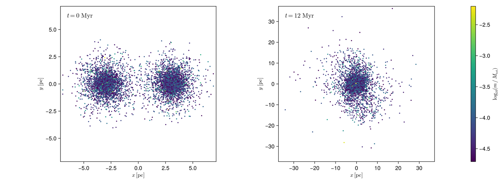

# Nbody6Dynamics.jl

A Julia package for automated setup, execution, post-processing, and visualisation of the [Nbody6PPGPU-beijing](https://github.com/nbody6ppgpu/Nbody6PPGPU-beijing) N-body astrophysical simulation code, plus a validated multi-cluster merger initial-condition generator.



*Two King clusters of 4000 stars each, released 6 pc apart on an eccentric orbit, and the
remnant they leave 20 Myr later, produced end to end by this package.*

## Features

- **Merger IC generation** — Multi-cluster initial conditions with validated King (1966) and Plummer samplers (King concentration `c(W0)` matches published values to <1%), Kroupa (2001) IMF in natural / rescaled / equal-mass modes, per-cluster virialisation to `Q = 0.5`, Jacobi truncation, Kepler or explicit orbit placement, and `dat.10` + `merger.inp` output for `KZ(22)=2`
- **Pipeline orchestration** — Single `run_pipeline(cfg)` entry point driven by `config.toml`: install/build → merger ICs → simulation → post-processing → plots, each phase independently switchable
- **Install & build** — Clone, configure, patch (HDF5 build flags), and compile Nbody6++GPU with auto-detected CUDA/MPI
- **Simulate** — Unique run IDs, frozen config snapshots, isolated `runs/<run_id>/` directories, real-time ADJUST monitoring
- **Post-process** — Readers for `conf.3_*` snapshots (Fortran binary), stdout diagnostics (`out1000`), Lagrangian radii (`lagr.7`), escapers (`esc.11`), stellar evolution (`sev.83_*`) and regularised binaries (`bev.82_*`)
- **Visualise** — Static figures and GIF animations with CairoMakie, including merger-specific diagnostics (inter-cluster separation, per-cluster virial ratio, IC overview plots)
- **External post-processing** — Config-free `postprocess_external(dir)` for arbitrary Nbody6++ output directories, with automatic file discovery via `scan_output`
- **Tests** — Unit tests against real output fixtures (`out1000`, `lagr.7`, `esc.11`, `sev.83`) plus physics validation (King concentration, Plummer `r_hm = 1.305a`, Kroupa mean mass, virialisation, Kepler/Jacobi relations)

## Quick Start

As a dependency of your own project (the package is not registered):

```julia
using Pkg
Pkg.add(url = "https://github.com/PaulGoG/Nbody6Dynamics.jl")
Pkg.add("CairoMakie")     # the figure backend
```

The directory of your `config.toml` is the project directory: the engine is built under its `backend/` and runs land under its `runs/`. `example_input("showcase/equal_pipeline.toml")` returns a shipped configuration to copy and edit.

From a checkout:

```bash
cd Nbody6Dynamics.jl

# Install Julia dependencies (one-time)
julia activate.jl          # package environment
julia scripts/activate.jl  # entry scripts: the package plus its figure backend

# Edit configuration
$EDITOR config.toml

# Run the full pipeline
julia scripts/run_setup.jl config.toml
```

The figure routines are a package extension (see [Visualisation](@ref "9. Visualisation")): a
session that produces figures loads a Makie backend first, a numerics-only session needs
neither the backend nor its dependencies.

```julia
using CairoMakie
using Nbody6Dynamics
run_pipeline(load_config("config.toml"))
```

## Usage Modes

| Mode                | Settings                                                        |
|:--------------------|:----------------------------------------------------------------|
| Full pipeline       | `install.enabled=true`, `simulation.run_test=true`              |
| Simulate only       | `install.enabled=false`, `simulation.run_test=true`             |
| Postprocess only    | `simulation.run_test=false`, `postprocess.data_dir="..."`       |
| Re-plot latest run  | `simulation.run_test=false`, `postprocess.data_dir=""`          |
| Merger ICs only     | `merger.enabled=true`, `simulation.run_test=false`              |
| Merger + simulate   | `merger.enabled=true`, `simulation.run_test=true`               |

## Programmatic API

```julia
using Nbody6Dynamics

# Full pipeline from config
cfg = load_config("config.toml")
results = run_pipeline(cfg)

# One-call merger IC generation (no config.toml needed)
result = run_merger_pipeline("input_files/mergers/merger_demo_small.toml")

# Post-process an external output directory directly
results = postprocess_external("/path/to/output")

# Quick scan of available output files
scan = scan_output("/path/to/output")
println(scan)

# Reload a previously generated merger IC (no re-sampling)
result = load_merger_ic_result("runs/merger_run_.../output")
```

See the [API Reference](@ref) for the complete public interface.

## Contents

```@contents
Pages = ["manual.md", "input_files.md", "showcase.md", "multi_cluster_mergers.md", "api.md"]
Depth = 2
```
